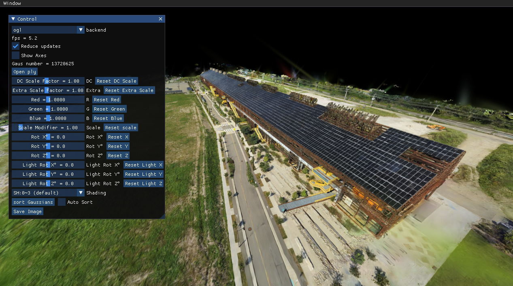
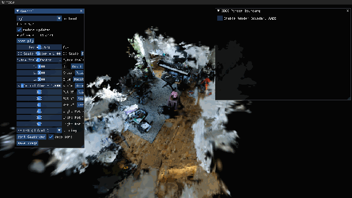
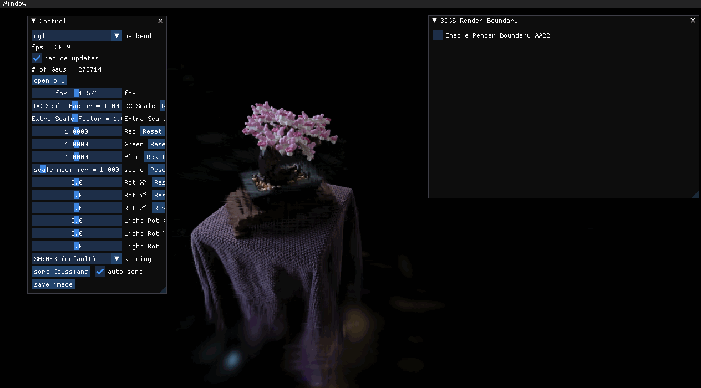
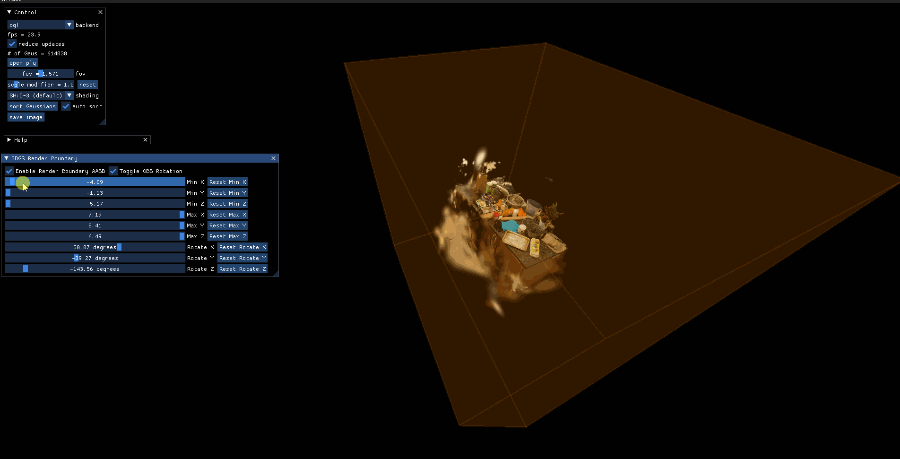
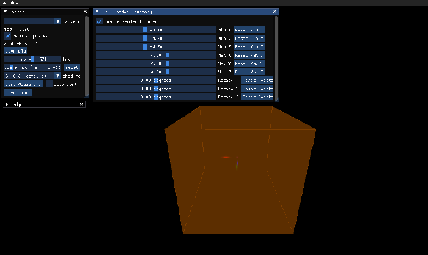

# Gaussian Splatting Viewer



This is a simple Gaussian Splatting Viewer built with PyOpenGL / CUDARasterizer. It's easy to install with minimum dependencies. The goal of this project is to provide a minimum example of the viewer for research and study purpose. 

## News

- 2024/09/20: Adding trackball rotation (free rotation) and using quaternions and rotation matrices to calculate the direction vector can avoid the gimbal lock problem that occurs with Euler angles in some cases, and x y z axes.
  
- 2024/08/28: Optimize the calculation speed required to derive Gaussian elements and solve the rot update bug.
  
- 2024/08/15: Added export based on bounding box range
  
  | initial:                                                     | export:                                                      |
  | ------------------------------------------------------------ | ------------------------------------------------------------ |
  |  |  |
  |  |  |
  
- 2024/08/05: Gaussian element control
  

- 2024/08/04: Enable the OBB axis and adjust the shader to constrain the rendering of Gaussian elements to determine whether they are within the bounding box content.
  

- 7/24/2024: Fix the memory leak problem and adjust the rendering bounding box to aabb mode and obb mode.
  
- 7/12/2024: Add boundary box rendering constraints.

  

- 1/10/2024: The OpenGL renderer has faster sorting backend with `torch.argsort` & `cupy.argsort`. With cuda based sorting, it achieves nearly real-time sorting with OpenGL backend.

- 12/21/2023: Now we support rendering using the official cuda rasterizer!

## Usage

Create a conda environment with Python 3.9:
```
conda create -n gsviewer python=3.9
conda activate gsviewer
```

Install the dependencies:
```
pip install -r requirements.txt
```

Launch the viewer:
```
python main.py
```

You can check how to use UI in the "help" panel.

The Gaussian file loader is compatiable with the official implementation. 
Therefore, download pretrained Gaussian PLY file from [this official link](https://repo-sam.inria.fr/fungraph/3d-gaussian-splatting/datasets/pretrained/models.zip), and select the "point_cloud.ply" you like by clicking the 'open ply' button, and you are all set!


## Optional dependencies:

- If you want to use `cuda` backend for rendering, please install the [diff-gaussian-rasterization](https://github.com/graphdeco-inria/diff-gaussian-rasterization) following the guidance [here](https://github.com/graphdeco-inria/gaussian-splatting). And also install the following package:
```
pip install cuda-python
```

- For sorting, we provide three backend: `torch`, `cupy`, and `cpu`. The implementation will choose the first available one based on this priority order: `torch -> cupy -> cpu`. If you have `torch` or `cupy` backend, turning on `auto sort` will achieve nearly real-time sorting.
    - If you want to use `torch` as sorting backend, install any version of [PyTorch](https://pytorch.org/get-started/locally/).

    - If you want to use `cupy` to accelerate sorting, you should install the following package:
    ```
    pip install cupy-cuda11x // for cuda 11
    pip install cupy-cuda12x // for cuda 12
    ```


## Troubleshoot

The rendering speed of is comparable to the official CUDA renderer. If you're experiencing slow rendering, it's likely you are using integrated graphics card instead of a high-performance one. You can configure python to use high-performance graphics card in system settings. In Windows, you can set in Setting > System > Display > Graphics. See the screenshot below for example.


## Limitations
- The implementation utilizes SSBO, which is only support by OpenGL version >= 4.3. Although this version is widely adopted, MacOS is an exception. As a result, this viewer does not support MacOS.

- The `cuda` backend currently does not support other visualizations.

- Based on the flip test between the two backends, the unofficial implementation seems producing slightly different results compared with the official cuda version.


## Packaging

Use `pipenv` to manage and package the project's dependencies:

1. Install `pipenv`:
   ```
   pip install pipenv 
   ```

2. Install dependencies and activate the virtual environment using the existing `Pipfile`:
   ```
   pipenv install
   pipenv shell
   ```

3. Package the application:
   
   - **Using `auto-py-to-exe`:**
     ```bash
     auto-py-to-exe
     ```
     In the auto-py-to-exe GUI, import Config from JSON file, and click convert button. JSON file is `AutoPyToExeConfig.json`.

   - **Using `pyinstaller`:**
     ```bash
     pyinstaller --noconfirm --onefile --windowed --icon "D:\small_tools_python\GSViewer\EXElogo.ico" --name "GSViewer" --clean --log-level "INFO" --add-data "D:\small_tools_python\GSViewer;GSViewer/" --add-binary "D:\Anaconda3\envs\pytorch\Lib\site-packages\glfw\glfw3.dll;." --add-data "D:\small_tools_python\GSViewer\gui;gui/" --add-data "D:\small_tools_python\GSViewer\render;render/" --add-data "D:\small_tools_python\GSViewer\shaders;shaders/" --add-data "D:\small_tools_python\GSViewer\tools;tools/" --add-data "D:\small_tools_python\GSViewer\tools\gsconverter;gsconverter/" --add-data "D:\small_tools_python\GSViewer\tools\gsconverter\utils;utils/"  "D:\small_tools_python\GSViewer\main.py"
     ```

4. Finally, you can find the executable file in the `output` folder.


## TODO
- Add orthogonal projection
- Make the projection matrix compatiable with official cuda implementation
- Tighter billboard to reduce number of fragments
- Save viewing parameters